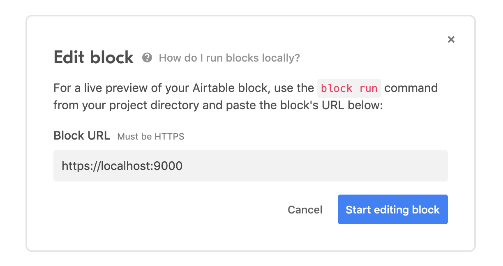
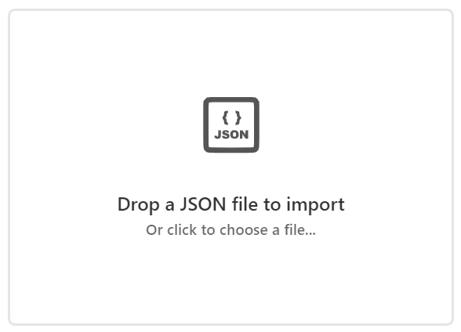
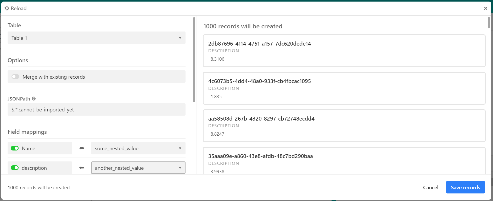

# 📊 JSON Import Block for Airtable
  

Written in TypeScript. Import data from JSON files, and query with [JSONPath](https://jsonpath.com/)

## Quick Start

Make sure that your npm user has access to Airtable's private packages.

1. Clone this git repo
    ```console
    $ git clone git@github.com:SiliconValleyInsight.com/airtable-json-block.git
    ```

1. Install necessary packages with npm

    ```console
    $ cd airtabe-json-block/json_import
    $ npm install @airtable/blocks-cli
    $ npm install @airtable/blocks
    $ npm install
    ```

1. Follow [this guide](https://airtable.com/developers/blocks/guides/hello-world-tutorial) to setup a new Block for your base
1. Take note of the Block ID (format: `blkxxxxxxxxx`) and Base ID (format: `appxxxxxxxxx`) from the guide above, modify the `baseID` and `blockID` in [remote.json](json_import/.block/remote.json), and save
1. Run `$ block run` and ensure that the Block is running locally
1. On your newly created Block from step 3, enter `htps://localhost:9000` as the URL and click **"Start editing block"**

    

## Developing

- Make sure to follow [Airtable's style guides](https://github.com/Hyperbase/airtable_style_guides) for [React](https://github.com/Hyperbase/airtable_style_guides/tree/master/react) and [TypeScript](https://github.com/Hyperbase/airtable_style_guides/tree/master/typescript)
- Install [eslint](https://eslint.org/) and [prettier](https://prettier.io/), and make sure to run both before committing a file

## Screenshots



_Block dashboard screen_



_JSON import and mapping screen_